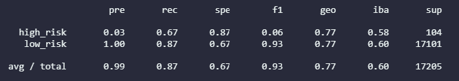
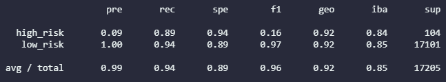
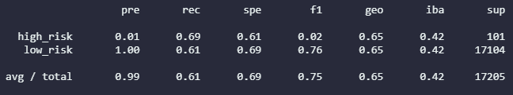
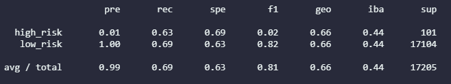
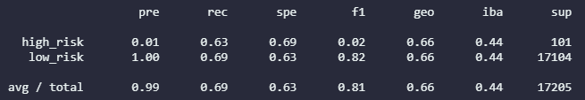

# Credit_Risk_Analysis
## Project Summary
The objective of this project is to analze credit card risk using different Machine Learning tools of the Imbalance Learn and Scikit Learn modules. The [Dataset](Resources/LoanStats_2019Q1.zip) used for this project can be found in the Resources folder under the name of LoanStats_2019Q1.zip.

### Tools
- Python
- Pandas
- Imbalanced Learn Library
- Scikit - learn Library

## Results
### Balanced Random Forest Classifier

- Accuracy Score: 0.79
- Precision: 0.99
- Recall: 0.70
- F1: 0.93

### Easy Ensemble AdaBoost Classifier

- Accuracy Score: 0.91
- Precision: 0.99
- Recall: 0.89
- F1: 0.96

### Logistic Regression

- Accuracy Score: 0.65
- Precision: 0.99
- Recall: 0.55
- F1: 0.71

### SMOTEENN Over/Under Sampling

- Accuracy Score: 0.649
- Precision: 0.99
- Recall: 0.60
- F1: 0.81
 

### SMOTE Oversampling

- Accuracy Score: 0.646
- Precision: 0.99
- Recall: 0.69
- F1: 0.81

### ClusterCentroids and Undersampling

- Accuracy Score: 0.544
- Precision: 0.99
- Recall: 0.69
- F1: 0.56

## Model Summary
Based on the information that we found, we can conclude that SMOTE and SMOTEENN are decent models for this dataset with F1 scores above 0.8. Balanced Random Forest and Easy Ensamble model are more robust because they have an F1 score of 0.96. Therefore I conclude that the best model for this analysis is the Easy Ensamble AdBoost Classifier.  
